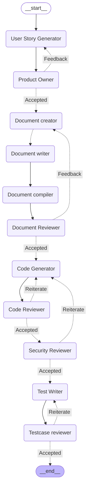

### End to End Agentic SDLC Project

# 🧠 Agentic AI for Software Design Life Cycle (SDLC)

An AI-powered pipeline that automates the **entire SDLC** using modular LLM agents built with [LangGraph](https://github.com/langchain-ai/langgraph) and [LangChain](https://github.com/langchain-ai/langchain).

## 🚀 Features

- ✅ User story generation from software requirements
- 📘 Design document sectioning and authoring
- 🧑‍💻 Source code generation (Python)
- 🔍 Code review and feedback loops
- 🔐 Security checks
- 🧪 Test case creation (with `pytest`)
- 🎯 Human-in-the-loop approvals for each step
- 🌐 Streamlit-based UI for interactive control
- 🔁 Iterative feedback cycles supported at all stages

## ⚙️ Architecture

The system is built using LangGraph's stateful graph model. Each phase of SDLC is a **graph node**, powered by a corresponding LLM agent. Here's how it works:

User Input ➝ User Story Generator ➝ Document Creator ➝ Document Writer ➝ Document Reviewer ➝ Code Generator ➝ Reviewer ➝ Security ➝ Test Writer ➝ Final Output

### Tech Stack

- 🧩 **LangGraph** – to model the SDLC workflow as a graph
- 🧠 **LLMs** – OpenAI (`gpt-4o`, `gpt-4`) or Groq models (`llama-3`, `gemma`)
- 🎛️ **Streamlit** – for user feedback, config, and step-wise UI
- 🗂️ **Python** – Modular, extensible structure

## 🛠️ Installation

1. Clone the repo:

   git clone https://github.com/your-username/agentic-sdlc.git
   cd agentic-sdlc

2. Install dependencies:

   pip install -r requirements.txt

3. Set up environment variables in a .env file:

   OPENAI_API_KEY=your_openai_key
   GROQ_API_KEY=your_groq_key

4. Run the app:

   streamlit run app.py

## 📷 Mermaid Diagram

## ✍️ Feedback Loop Support

At any stage (user stories, design, code, test), if the human reviewer provides feedback, the pipeline automatically routes back and regenerates output — just like a real review cycle.

## 📦 Folder Structure

src/
  SDLC/
    ui/         → Streamlit UI
    LLM/        → Model setup and orchestration
    graph/      → LangGraph builder
    nodes/      → Individual agent logic (story, doc, code, test)
    state/      → TypedDict + Pydantic-based state

## 🧩 Customization

You can plug in other models or modify the stages easily. Just update the LLMconfig and SDLC_Nodes to reflect new capabilities.

## 🙌 Credits

LangGraph

LangChain

Streamlit

## 📬 Contributions

PRs welcome! Please open an issue first to discuss major changes.
